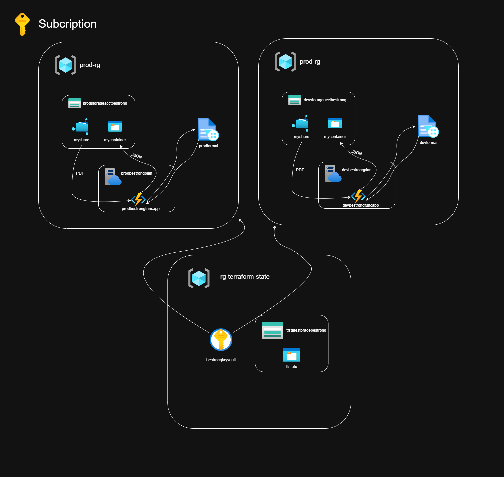

# BeStrong Infrastructure (Terraform)

This repository contains Terraform configurations to manage the infrastructure for the BeStrong application across multiple environments (dev, prod) in Azure.

### Diagram describes interaction inside created infrastructure

---

## Architecture Overview

The infrastructure is divided into 3 main resource groups:

### `rg-terraform-state` (Shared)

#### It needs to be pre-configured and persistent

- **Key Vault**: `newbestrongkeyvault`
  - Stores sensitive credentials (`client_id`, `client_secret`, etc.)
- **Storage Account**: `tfstatestoragebestrong`
  - Blob container `tfstate` holds remote Terraform state files

### `prod-rg` and `dev-rg` (Per Environment)

- **Storage Account** (`prodstorageacctbestrong` / `devstorageacctbestrong`)
  - File Share: `myshare`
  - Blob Container: `mycontainer`
- **Azure Function App** (`prodbestrongfuncapp`/`devbestrongfuncapp`)
  - Triggered by JSON file uploads
  - Processes PDF files and writes outputs
- **App Plan** (`prodbestrongplan`/`devbestrongplan`)
- **Form recognizer**: `prodformai` / `devformai`

---

## Getting Started

Trigger the pipeline in **Azure DevOps**.

---

## Secrets Management

Secrets are stored in **Azure Key Vault**
